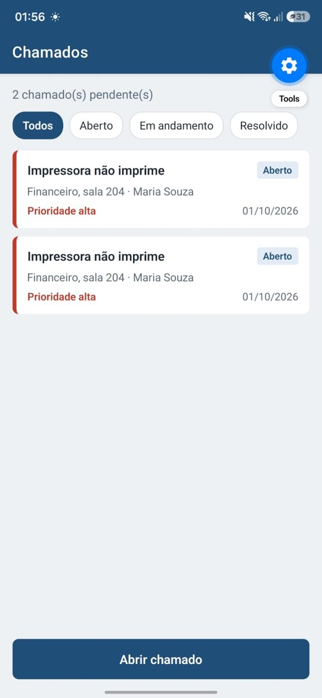
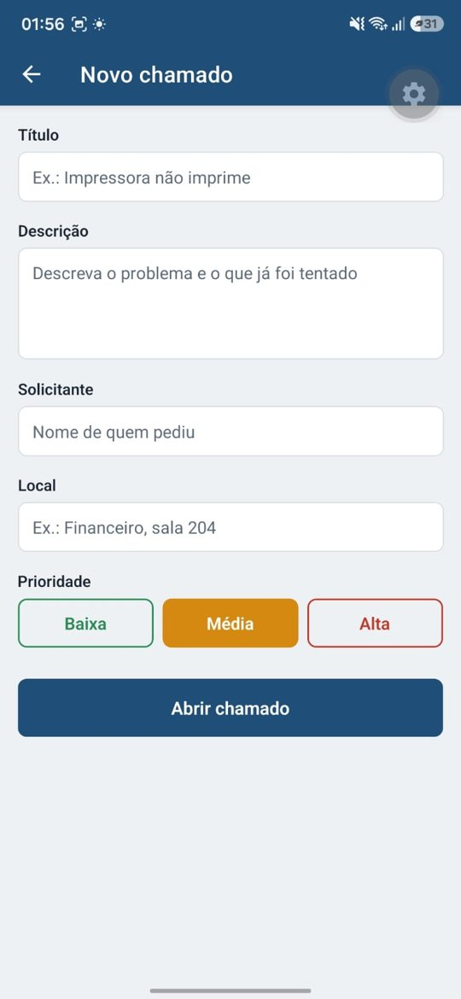
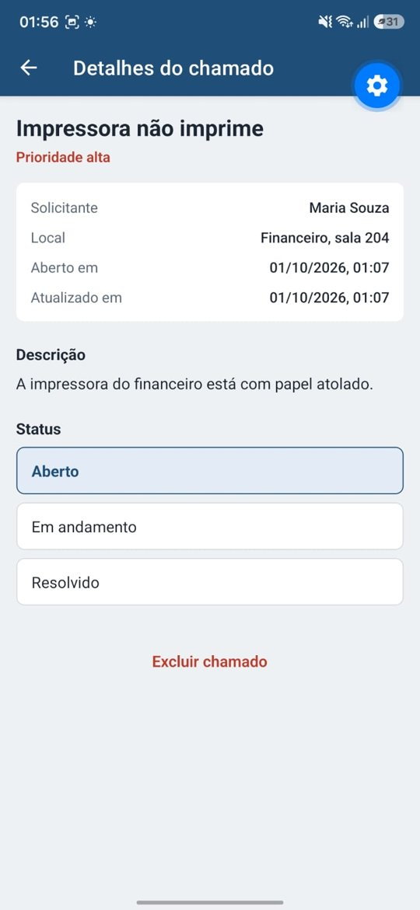

# HelpDesk Mobile

Aplicativo mobile para gestão de chamados de suporte técnico (TI), feito com **React Native**, **Expo** e **TypeScript**.

O técnico consegue abrir chamados, acompanhar a fila por status, ver os detalhes de cada atendimento e atualizar o andamento direto pelo celular.

Os dados ficam salvos na [HelpDesk API](https://github.com/JoaoVictor852529/helpdesk-api) (Node.js, Express, PostgreSQL e Docker), que este app consome via HTTP.

## Funcionalidades

- Abertura de chamados com título, descrição, solicitante, local e prioridade
- Lista de chamados com filtro por status (aberto, em andamento, resolvido)
- Contador de chamados pendentes
- Tela de detalhes com alteração de status e exclusão
- Prioridade indicada por cor (alta, média, baixa)
- Integração com API REST, com tratamento de erros de conexão e de validação
- Atualização da lista puxando para baixo (pull to refresh)

## Telas

<p align="center">
  
  
  
</p>

## Tecnologias

- React Native + Expo
- TypeScript
- Expo Router (navegação baseada em arquivos)
- Fetch API (integração com o back-end)

## Estrutura do projeto

```
src/
├── app/                  # Telas (cada arquivo vira uma rota)
│   ├── _layout.tsx       # Navegação e cabeçalho
│   ├── index.tsx         # Lista de chamados
│   ├── novo.tsx          # Formulário de novo chamado
│   └── chamado/[id].tsx  # Detalhes do chamado
├── components/
│   └── ChamadoCard.tsx   # Card usado na lista
├── services/
│   └── chamados.ts       # Comunicação com a API (criar, listar, atualizar, excluir)
├── types/
│   └── chamado.ts        # Tipos TypeScript
└── theme.ts              # Cores do app
```

A camada `services/` isola o acesso aos dados: as telas não sabem de onde os chamados vêm. Na primeira versão eles ficavam salvos no celular; a troca para a API foi feita alterando só esse arquivo.

## Como rodar

Pré-requisitos: [Node.js](https://nodejs.org) (versão LTS), o app **Expo Go** no celular e a [HelpDesk API](https://github.com/JoaoVictor852529/helpdesk-api) rodando.

1. Copie `.env.example` para `.env.local` e coloque o IP do seu computador:
   ```
   EXPO_PUBLIC_API_URL=http://192.168.0.10:3333
   ```
2. Instale e rode:
   ```bash
   npm install
   npx expo start
   ```

Escaneie o QR Code com o Expo Go (Android) ou com a câmera (iPhone). O celular e o computador precisam estar na mesma rede Wi-Fi.

## Próximos passos

- [ ] Anexar foto do problema com a câmera
- [ ] Busca por texto
- [ ] Notificações
- [x] Integração com API Node.js + PostgreSQL
- [ ] Login com JWT

## Autor

João Victor — [LinkedIn](https://www.linkedin.com/in/jo%C3%A3o-victor-100a12354/) · [GitHub](https://github.com/JoaoVictor852529)
